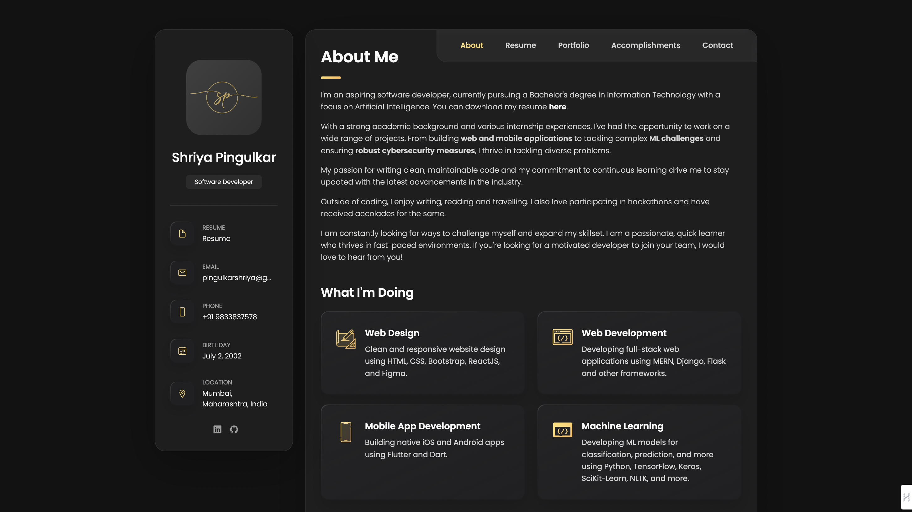

# Personal Portfolio Website

## Introduction
This repository contains the README for my personal portfolio website. The actual website and its contents are hosted elsewhere. This README provides an overview and a link to access my portfolio.

## Accessing the Portfolio
**Portfolio Link:** [Click here to view my portfolio](https://shriyapingulkar.netlify.app/)

## Overview
The portfolio showcases my work, skills, and projects in a professional and visually appealing way. It's designed to provide visitors with a comprehensive understanding of my capabilities and experiences.

## Features
- **About me**: Introduction and a brief about my journey along with my certifications
- **Resume**: Overview of my educational qualification and internship experiences
- **Portfolio**: Showcase of my work and contributions.
- **Accomplishments**: A list of my accomplishments along with my positions of responsibility.
- **Contact**: How to get in touch with me.

#### Note
This repository is kept minimal and only contains this README as per my personal organization preferences. The code and detailed content are maintained privately.

Thank you for your interest in my portfolio!

